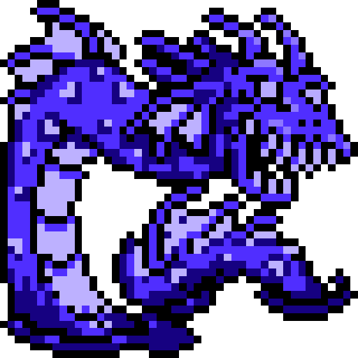

<h2 style="color: #fff; text-shadow: 0 0 10px #df335f;">Of Dragons Deep - A FFXIV Fishing Tracker</h2>

"Erratic flows of aether released after the Calamity not only resulted in a warping of the landscape, but of the creatures that dwell upon it as well. Such is the case of the Nepto Dragon─a little Thalaos grown to epic proportions."

